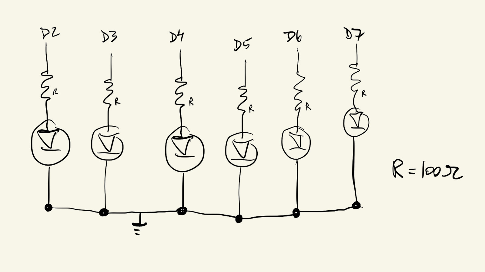
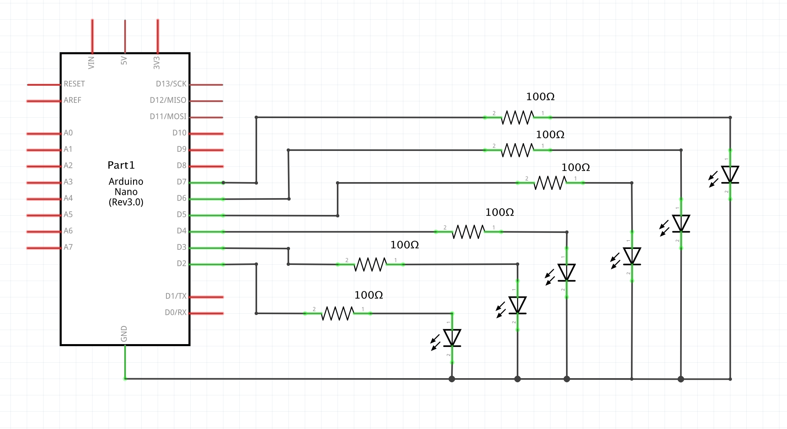
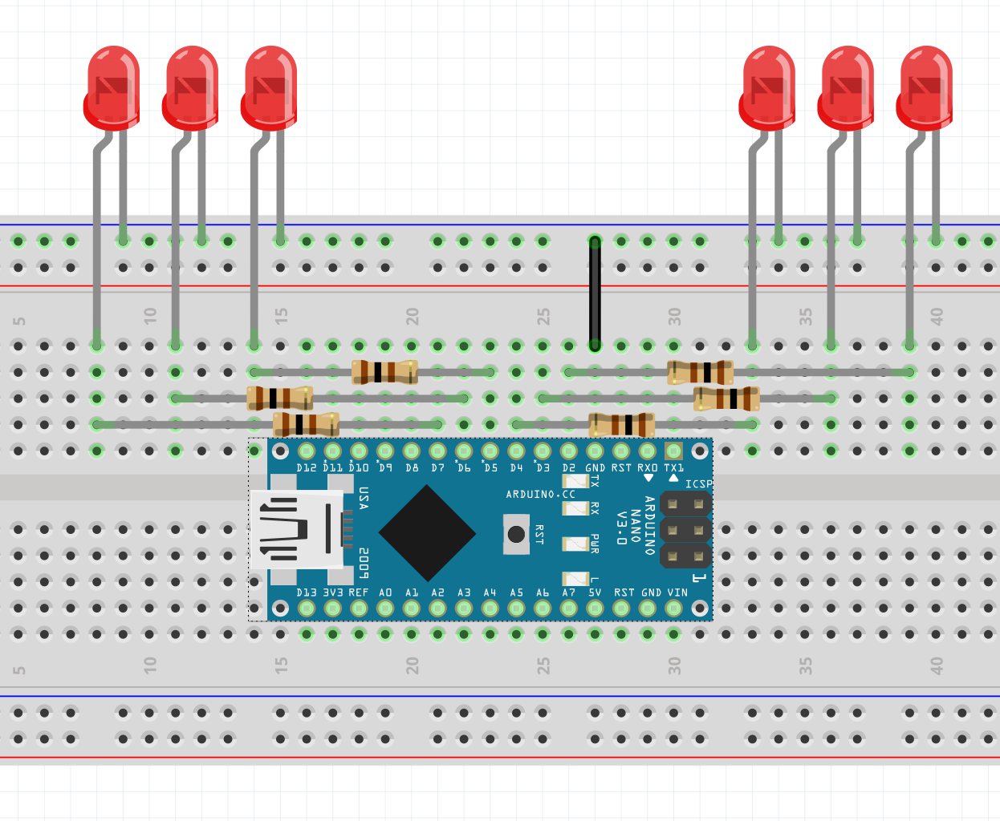

# HW10

Display number of seconds, alternating between two representations every minute: binary and decimal.

### Wall-Second Logic

The logic I implemented for transforming ```millis()``` into wall-seconds is this:

```ellapsedSeconds = millis() / 1000;```

```wallSeconds = ellapsedSeconds % 60;```

This turns ```ellapsedSeconds``` from an unbound sequence that grows to infinity, into a sequence that cycles between 0 and 59.


### Binary Representation

Let's look at the binary representation of some numbers between 0 and 59:

| decimal | binary | | decimal | binary |
| --- | --- | ------- | --- | --- |
|  0 | 000000 | | 16 | 010000 |
|  1 | 000001 | | 17 | 010001 |
|  2 | 000010 | | 18 | 010010 |
|  3 | 000011 | | 19 | 010011 |
|  4 | 000100 | | 20 | 010100 |
|  5 | 000101 | | 21 | 010101 |
|  6 | 000110 | | 22 | 010110 |
|  7 | 000111 | | 23 | 010111 |
|  8 | 001000 | | 24 | 011000 |
|  9 | 001001 | | 25 | 011001 |
| 10 | 001010 | | 26 | 011010 |
| 11 | 001011 | | 27 | 011011 |
| 12 | 001100 | | 28 | 011100 |
| 13 | 001101 | | 29 | 011101 |
| 14 | 001110 | | 30 | 011110 |
| 15 | 001111 | | 31 | 011111 |
| ... | ... | | ... | ... |


There's a pattern !

The right-most binary bit toggles every second, the second bit toggles every 2 seconds, the third every 4 seconds, then 8, then 16, then 32.

Knowing that something like this toggles between 0 and 1 every ```N``` seconds:

```(seconds / N) % 2```

It's just a matter of using the powers of 2 (1, 2, 4, 8, 16, 32) for ```N``` in a for loop.


### Decimal Representation

Each LED represents 10 seconds.

Those 10 seconds are mapped into analog values between 0 and 255.

For example, after 5 seconds, the first LED is half-lit; after 37 seconds, the first 3 LEDs are fully lit and the fourth is 66% lit.


### Issues, Challenges & Difficulties

One issue I faced with the *Decimal* representation is that this Arduino board only allows for 5 active PWM pins at a time. Took me a while to figure that out.

Another issue was that switching between *Decimal* and *Binary* representations required some pins to switch between being an analog output to a digital output. Apparently the Arduino doesn't like that very much and some pins would get stuck with previous values.

This was fixed by just running the ```setup()``` function every loop and resetting the ```pinMode()``` for all used pins.

### Sketch



### Schematic



### Board



Board looks different in video because I had to use a separate board to keep HW and class circuits separate :p

### Video

[wk10-hw10-01.webm](https://github.com/DM-GY-6063-2023F-D/HW10/assets/850815/9bc00f47-c109-40bd-804d-5ab0e4486c57)

Video is sped up so I could show more than 1 minute in 30 seconds.
